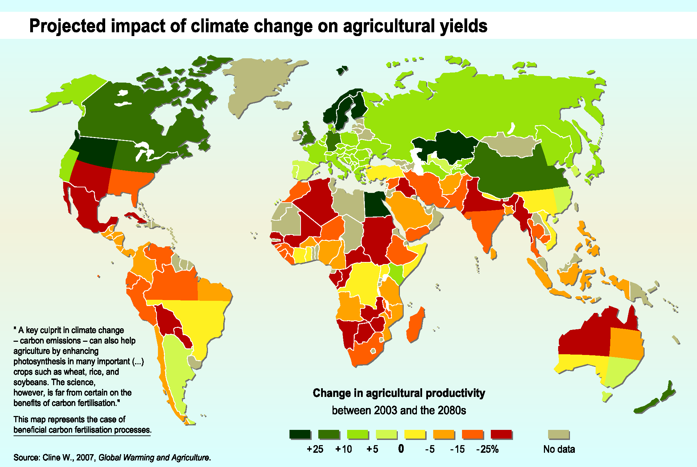
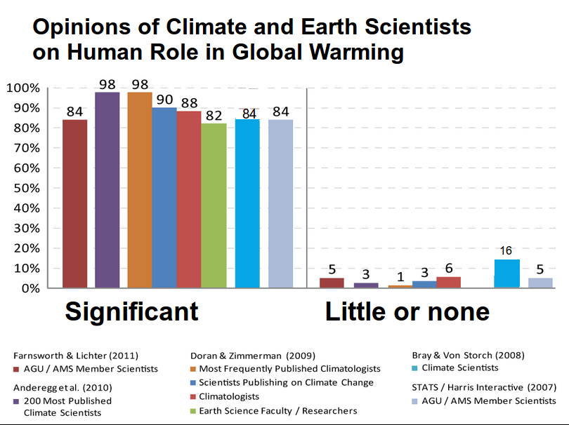
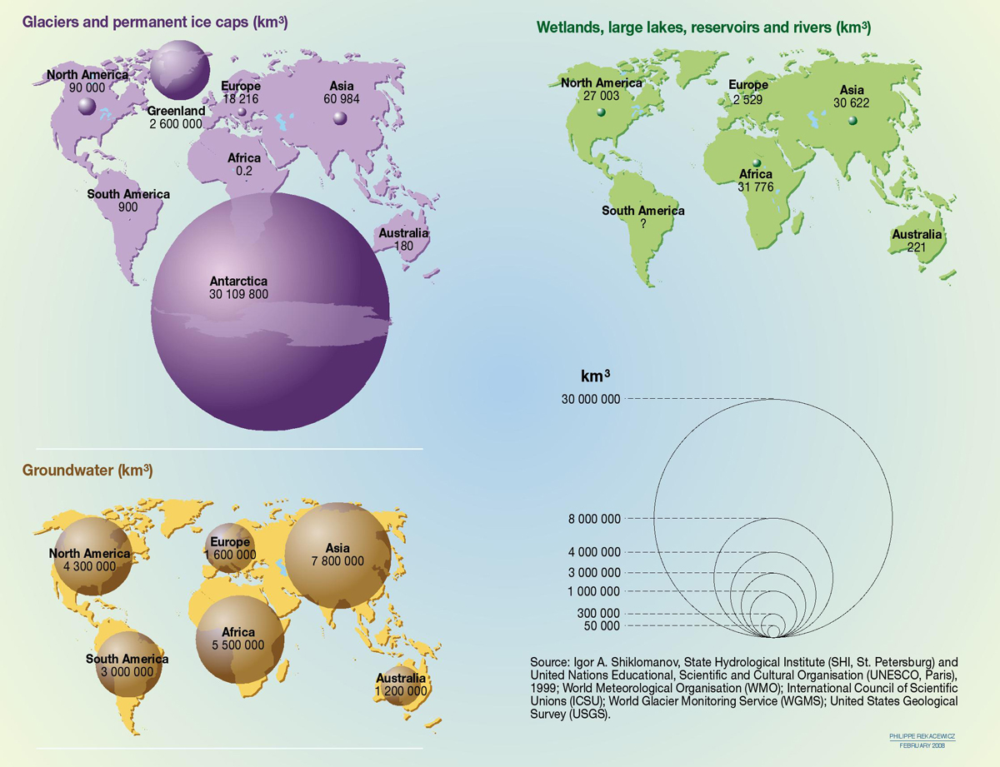

# Week 2 - Exercise 4

Find at least three statistical visualizations that you think aren’t very good, and identify their problems. Copying examples from various junk chart websites isn’t accepted – you should find your own junk charts. You should be able to find good (or rather, bad) examples quite easily since a large fraction of charts have at least some issues. The examples you choose should also have different problems, so don’t look for three column or bar charts whose axes don’t begin at zero. Try to find as interesting and diverse examples as you can.

## Excluding choise of colors

I chose this chart as an example of a junk chart because it's violationg the rule that one should avoid using red and green together since red-green blindness is rather common condition. For someone with that condition it might not be as clear that climate change is beneficial for agriculture in the northern parts of our globe where for the rest it is rather harmful.

[Source](https://i.redditmedia.com/rvtveUq0OZnMGbh7fneq4PvQWhFFi1eqyP3quaLmPjU.png?s=47ddd8ae13c6e734de0f2c22fac93f3c)

## Dependent on the legend

I chose this chart as an example of a chart which is very dependent of it's legend and thus requires a lot of effort to skim through.

[Source](https://upload.wikimedia.org/wikipedia/commons/a/a7/Climate_science_opinion2.png)

### Not following the minimal ink-data ratio rule

This chart I chose as an example of violation the ink-data ratio rule. It shows the actual amounts on the maps but also describes in the lower right corner what each size represents. It is also not wise to use area to describe actual amounts since humans tend to underestimate the difference between a smaller and a larger area.

Source: UNESCO, WMO, ICSU, USGS
